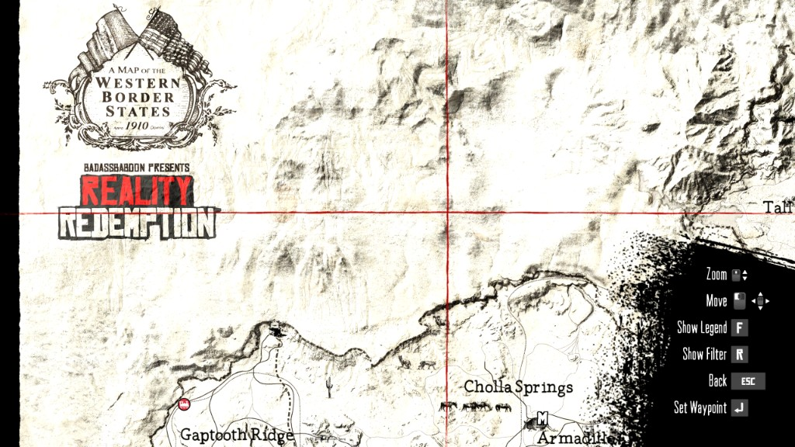

# Reality Redemption BETA 3.0 PC Installer (Linux)

Auto-installer for the Reality Redemption mod for Red Dead Redemption on PC. Runs natively on Linux via bash and uses Wine to run MagicRDR.exe (a .NET tool that modifies game archives).

## Getting Started

1. **Download the mod** from the official source: [Nexus Mods – Reality Redemption](https://www.nexusmods.com/reddeadredemption/mods/219)
2. **Add this bash script** (`RR Beta 3.0 PC Installer.sh`) to the Reality Redemption folder you downloaded.
3. Place the Reality Redemption folder inside your game directory and run the script (see below).

## Prerequisites

- **Wine** (with 32-bit support for MagicRDR.exe)
- **Winetricks**
- **.NET Framework 4.8** – installed via winetricks into the Wine prefix (see Setup)

### Install by distro

| Distro        | Command                                   |
| ------------- | ----------------------------------------- |
| Ubuntu/Debian | `sudo apt install wine wine32 winetricks` |
| Fedora        | `sudo dnf install wine winetricks`        |
| Arch          | `sudo pacman -S wine winetricks`          |
| openSUSE      | `sudo zypper install wine winetricks`     |

On Ubuntu/Debian, if `wine32` fails, first run: `sudo dpkg --add-architecture i386 && sudo apt update`

## Directory Layout

Place the Reality Redemption folder **inside** your game directory (same level as RDR.exe). Run the script **from inside** the Reality Redemption folder.

```
GameFolder/                    <- RDR.exe, game/, update/, plugins/
  game/                        <- camera.rpf, content.rpf, fragments.rpf, etc.
  update/game/                 <- modded RPF files (created by installer)
  plugins/
  Reality Redemption/          <- Mod folder; run script from here
    RR Beta 3.0 PC Installer.sh
    RR-Files/
    MagicRDR.exe
    Assemblies/
```

## One-Time Wine Setup (Recommended)

1. Install Wine and winetricks for your distro (see table above).

2. Create a dedicated 32-bit Wine prefix and install .NET:

   ```bash
   WINEPREFIX=~/.wine-rr WINEARCH=win32 winetricks dotnet48
   ```

   First run may take several minutes; follow any prompts.

## Running the Installer

1. Make the script executable (if needed):

   ```bash
   chmod +x "RR Beta 3.0 PC Installer.sh"
   ```

2. Run from inside the Reality Redemption folder with the same prefix used for setup:

   ```bash
   cd "/path/to/GameFolder/Reality Redemption"
   WINEPREFIX=~/.wine-rr WINEARCH=win32 ./"RR Beta 3.0 PC Installer.sh"
   ```

3. For help and troubleshooting steps:

   ```bash
   ./"RR Beta 3.0 PC Installer.sh" --help
   ```

## Running the Game on Steam

If you run Red Dead Redemption through Steam (Proton), add this to the game's launch options so the mod loads correctly:

```
WINEDLLOVERRIDES="dinput8.dll=n,b" %command%
```

Right-click the game in Steam → Properties → Launch Options, then paste the line above. This tells Wine/Proton to use the mod's ASI loader (dinput8.dll) instead of the built-in one.

## Verifying the Installation

If you see the **Reality Redemption** logo (BADASSBABOON PRESENTS REALITY REDEMPTION) when opening the in-game map, the mod was applied successfully.



## Installer Options

- **[1] Install** – Full or manual installation of the mod
- **[2] Uninstall** – Remove the mod
- **[3] Exit**

## Troubleshooting

| Error                                 | Solution                                                                                                                                                                        |
| ------------------------------------- | ------------------------------------------------------------------------------------------------------------------------------------------------------------------------------- |
| `kernel32.dll` / `c0000135`           | 32-bit Wine missing or corrupted prefix. Try: `rm -rf ~/.wine` (or `~/.wine-rr`), install wine/wine32 for your distro, then re-run with `WINEPREFIX=~/.wine-rr WINEARCH=win32`. |
| `Wine Mono is not installed`          | Install winetricks for your distro, then `WINEPREFIX=~/.wine-rr WINEARCH=win32 winetricks dotnet48`. Re-run the script with the same prefix.                                    |
| "Required game files cannot be found" | Ensure the Reality Redemption folder is inside the game directory and the script is run from inside the Reality Redemption folder.                                              |

## Notes

- **WINEPREFIX / WINEARCH**: If you use a custom prefix for setup, always use the same when running the script.
- **Repeated runs**: No need to reinstall dotnet48 or delete the prefix; run the script as often as needed.
- **Game**: Red Dead Redemption (PC).
